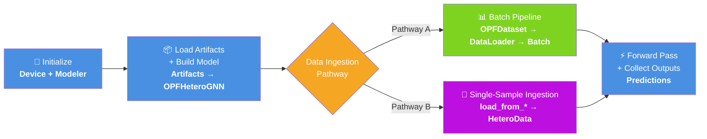

# ⚡ lumina-inference

Lightweight inference package for **LUMINA** trained models. Load models from Hugging Face and run predictions.



## 📦 Installation

Install from source:

```bash
git clone https://github.com/argonne-gridfm/lumina-inference.git
cd lumina-inference
pip install -e .
```

### Prerequisites

- 🐍 Python ≥ 3.9
- 🔥 PyTorch ≥ 2.0
- 🔗 PyTorch Geometric ≥ 2.4

## 🚀 Quick Start

### 🔌 Standard OPF Dataset Pipeline

```python
import json
import torch
from huggingface_hub import hf_hub_download
from safetensors.torch import load_file

from lumina_inference.modeler import Modeler
from lumina_inference.dataset.opf_dataset import OPFDataset
from lumina_inference.loader.opf_loader import DataLoader

# Download model artifacts from Hugging Face
config_path = hf_hub_download(repo_id="argonne/LUMINA-1B", filename="config.json")
safetensors_path = hf_hub_download(repo_id="argonne/LUMINA-1B", filename="model.safetensors")

# Load config
with open(config_path, "r") as f:
    config_data = json.load(f)

# Set up device and modeler
device = torch.device("cuda" if torch.cuda.is_available() else "cpu")
modeler = Modeler(device)

# Load model
state_dict = load_file(safetensors_path)
modeler.load_model(config_data, state_dict)

# Load dataset and create loader
case_name = config_data.get("case_name", "pglib_opf_case14_ieee")
dataset = OPFDataset(root="./opf_data", case_name=case_name)
loader = DataLoader(dataset, batch_size=1, shuffle=False)

# Run predictions
preds = modeler.run_predictions(loader, max_batches=50)
print(f"Collected predictions for {len(preds)} batches.")
```

### ✨ Flexible Ingestion (New)

Load data from Python dicts, JSON strings, JSON files, or MATPOWER `.m` files — no `OPFDataset` pipeline required:

```python
from lumina_inference import load_from_dict, load_from_json_file, load_from_matpower

# From a Python dict (no ground-truth solution needed)
data = load_from_dict(opf_dict)

# From a JSON file
data = load_from_json_file("path/to/case.json", require_solution=False)

# From a MATPOWER .m file (requires pandapower)
data = load_from_matpower("path/to/case14.m")

# Single-sample prediction (no DataLoader needed)
predictions = modeler.predict_single(data)
print(predictions["bus"].shape)       # [n_bus, 2]  — va, vm
print(predictions["generator"].shape) # [n_gen, 2]  — pg, qg
```

### 🧬 Generic Heterogeneous Graphs

Build arbitrary `HeteroData` objects for non-OPF use cases:

```python
import torch
from lumina_inference import build_hetero_data

data = build_hetero_data(
    nodes={
        "protein": {"x": torch.randn(100, 64)},
        "drug":    {"x": torch.randn(50, 32)},
    },
    edges={
        ("protein", "interacts", "drug"): {
            "edge_index": torch.randint(0, 50, (2, 200)),
        },
    },
)
```

> 📖 See [docs/flexible_ingestion.md](docs/flexible_ingestion.md) for the full guide and [examples/flexible_ingestion.py](examples/flexible_ingestion.py) for runnable examples.

## 🗂️ Model Artifacts

This package expects two files from the Hugging Face model repository:

| File | Description |
|---|---|
| `config.json` | Model architecture configuration (metadata, input channels, hidden channels, etc.) |
| `model.safetensors` | Model weights in SafeTensors format |

These are downloaded automatically via `huggingface_hub.hf_hub_download()`.

## 📐 Input Data Format

The package uses the **OPFData** heterogeneous graph format with the following node and edge types:

### 🟢 Node Types
- **`bus`**: Power system buses with features `[base_kv, vmin, vmax, bus_type_onehot...]` (7 features)
- **`generator`**: Generators with features `[mbase, pg, pmin, pmax, qg, qmin, qmax, vg, costs...]` (11 features)
- **`load`**: Loads with features `[pd, qd]` (2 features)
- **`shunt`**: Shunts with features `[bs, gs]` (2 features)

### 🔗 Edge Types
- **`('bus', 'ac_line', 'bus')`**: AC transmission lines with impedance/rating attributes
- **`('bus', 'transformer', 'bus')`**: Transformers with tap/shift attributes
- **`('generator', 'generator_link', 'bus')`**: Generator-to-bus connections
- **`('load', 'load_link', 'bus')`**: Load-to-bus connections
- **`('shunt', 'shunt_link', 'bus')`**: Shunt-to-bus connections

### 📤 Output Format

Predictions are returned as a dictionary mapping node types to tensors:
- `predictions['bus']`: Tensor of shape `[n_bus, 2]` — voltage angle (va) and voltage magnitude (vm)
- `predictions['generator']`: Tensor of shape `[n_gen, 2]` — active power (pg) and reactive power (qg)

## 🐳 Docker

Build and run with Docker:

```bash
# Build CPU image
docker build -t lumina-inference .

# Run tests
docker run --rm lumina-inference pytest tests/test_flexible_ingestion.py -v

# Interactive shell
docker run --rm -it lumina-inference bash
```

Or use Docker Compose:

```bash
# Run inference check
docker compose up inference

# Run test suite
docker compose up test

# GPU inference (requires NVIDIA Container Toolkit)
docker compose --profile gpu up inference-gpu
```

Build with GPU support:

```bash
docker build \
  --build-arg BASE_IMAGE=pytorch/pytorch:2.3.1-cuda12.1-cudnn9-runtime \
  -t lumina-inference:gpu .
```

## 📚 API Reference

### 🎯 `Modeler(device, *, fail_on_missing=False, verbose=True)`

Main class for loading models and running predictions.

**Methods:**
- `load_model(config_data, state_dict)` — Construct model from config and load weights
- `predict_batch(batch, minmax_scaling=True)` — Run forward pass on a single batch
- `predict_single(data, minmax_scaling=True, validate=True)` — Run prediction on a single `HeteroData` sample (no DataLoader needed)
- `run_predictions(loader, max_batches=None, minmax_scaling=True)` — Run predictions over a data loader

### 📥 Ingestion Functions

| Function | Description |
|---|---|
| `load_from_dict(data_dict, require_solution=False)` | Convert a Python dict to `HeteroData` |
| `load_from_json_file(path, require_solution=False)` | Load from a JSON file |
| `load_from_json_string(json_str, require_solution=False)` | Parse a JSON string |
| `load_from_matpower(path)` | Load from a MATPOWER `.m` file (requires `pandapower`) |
| `process_opf_dict(obj, require_solution=False)` | Core OPF dict → `HeteroData` converter |
| `build_hetero_data(nodes, edges, graph_attrs=None)` | Build generic `HeteroData` from dicts |

### 🛡️ Validation

| Function / Class | Description |
|---|---|
| `detect_schema(data)` | Returns `"opf"` or `"generic"` based on node types |
| `validate_hetero_data(data, model_metadata, model_input_channels)` | Validate data against model expectations |
| `validate_opf_schema(data)` | Validate OPF-specific schema and feature dimensions |
| `SchemaValidationError` | Raised when schema doesn't match expectations |
| `FeatureDimensionError` | Raised when feature dimensions are wrong |
| `MissingDataError` | Raised when required data is missing |

### 📊 `OPFDataset(root, case_name, group_id=0, ...)`

Dataset class for loading OPF data from the GridOpt dataset.

### 🔄 `DataLoader(dataset, batch_size=1, shuffle=False, ...)`

Data loader with heterogeneous graph batching support.

## 🗺️ Supported Cases

| Case Name | Buses |
|---|---|
| `pglib_opf_case14_ieee` | 14 |
| `pglib_opf_case30_ieee` | 30 |
| `pglib_opf_case57_ieee` | 57 |
| `pglib_opf_case118_ieee` | 118 |
| `pglib_opf_case500_goc` | 500 |
| `pglib_opf_case2000_goc` | 2,000 |
| `pglib_opf_case4661_sdet` | 4,661 |
| `pglib_opf_case6470_rte` | 6,470 |
| `pglib_opf_case10000_goc` | 10,000 |
| `pglib_opf_case13659_pegase` | 13,659 |

## 📄 License

Apache License 2.0. See [LICENSE](LICENSE) and [NOTICE](NOTICE) for details.

Copyright 2026 UChicago Argonne, LLC.
